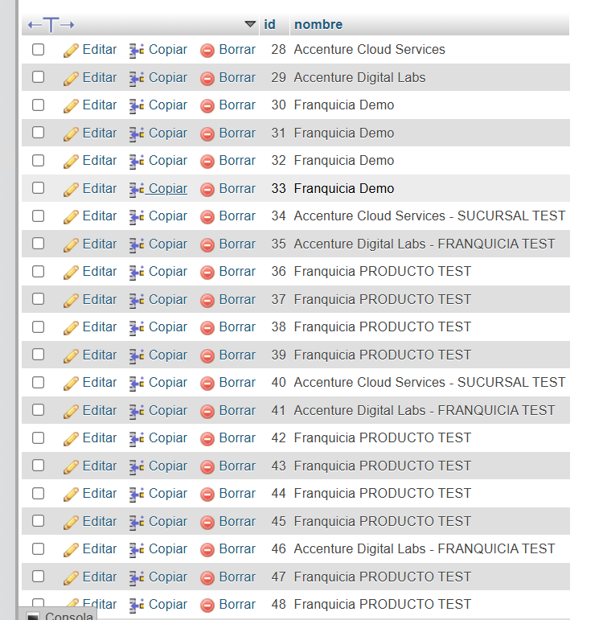
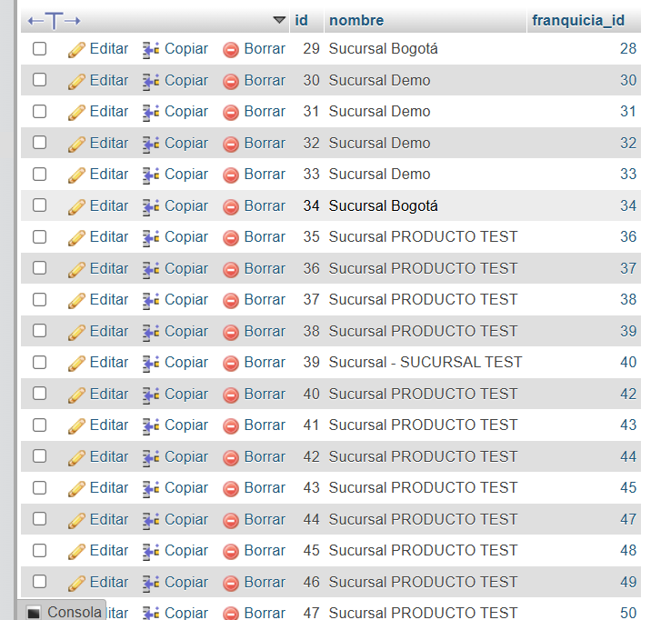
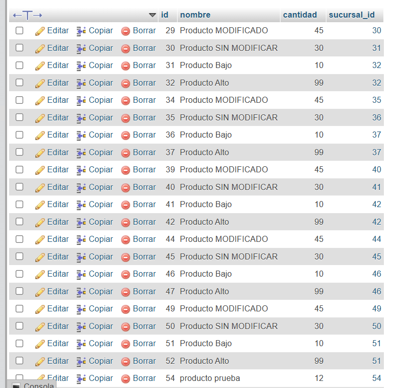

# pruebaAccenture

Buenas tardes, para que el proyecto funciones deben crear una BD con este nombre; franquicia
Estos son los SQL de las tablas; 

-- Crear base de datos (si no existe)
CREATE DATABASE IF NOT EXISTS franquicia;
USE franquicia;

-- Tabla franquicia
CREATE TABLE franquicia (
    id BIGINT AUTO_INCREMENT PRIMARY KEY,
    nombre VARCHAR(100) NOT NULL
);

-- Tabla sucursal
CREATE TABLE sucursal (
    id BIGINT AUTO_INCREMENT PRIMARY KEY,
    nombre VARCHAR(100) NOT NULL,
    franquicia_id BIGINT NOT NULL,
    FOREIGN KEY (franquicia_id) REFERENCES franquicia(id) ON DELETE CASCADE
);

-- Tabla producto
CREATE TABLE producto (
    id BIGINT AUTO_INCREMENT PRIMARY KEY,
    nombre VARCHAR(100) NOT NULL,
    cantidad INT NOT NULL,
    sucursal_id BIGINT NOT NULL,
    FOREIGN KEY (sucursal_id) REFERENCES sucursal(id) ON DELETE CASCADE
);

También se les deja un Postman ordenado con cada una de las API's creadas.
Pruebas realizadas con MockMvc y manualmente.

